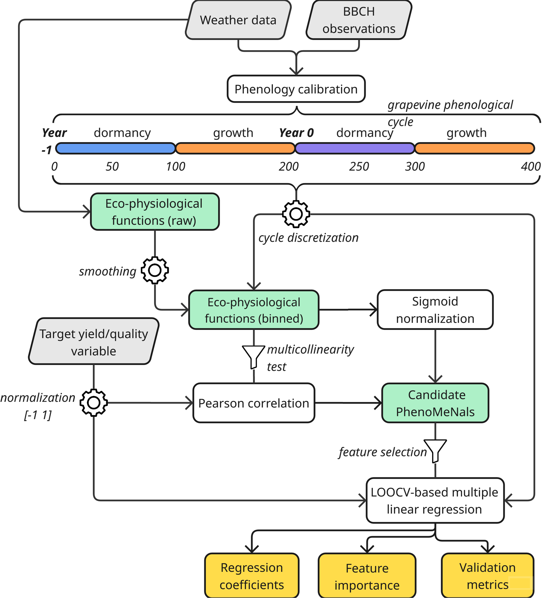

<table align="center">
<tr>
  <td><h1>PhenoMeNals – Phenology Memory Signals</h1></td>
  <td></td>
</tr>
</table>

[](https://creativecommons.org/licenses/by-nc/3.0/)
[](https://microsoft.com)  
[](https://cran.r-project.org/)  


---

## 📖 Overview
**PhenoMeNals** is a phenology-aware predictive framework for **grapevine yield and quality forecasting**, integrating **phenology simulation**, **eco-physiological functions**, and **statistical modeling**.  

The framework explicitly accounts for the **two-year reproductive cycle of grapevine**, combining a **dormancy-forcing phenology model** with cumulative “memory signals” derived from environmental cues (temperature, radiation, water status, biotic and abiotic stresses). These signals are aligned along a standardized phenological timeline and weighted by their correlation with yield- and quality-related traits, enabling **biologically meaningful predictions** and interpretation of carry-over effects.  

> **Note:** PhenoMeNals is released as an **R package** with **C# routines** invoked from R. It is currently available only on **Windows**, but cross-platform compatibility is under development. 

---

## Table of Contents

- [Highlights](#highlights)
- [Description](#description)
- [Installation](#installation)
- [Getting Started](#getting-started)
  - [phenologyCalibration()](#phenologyCalibration())
  - [runPhenomenals()](#runPhenomenals()) 
- [Support](#support)
- [License](#license)
- [How It Works](#how-it-works)
  
---

## Highlights

- 🍇 **PhenoMeNals** predicts grapevine yield and quality using **phenology-aware environmental signals**  
- 🧠 **Process-based framework** integrating phenology simulation, eco-physiological functions, and statistical modeling  
- 📈 Accurate forecasting across **multiple sites, varieties, and years** using cross-validation  
- 🔍 Analysis of **carry-over effects** and phase-specific environmental influences on yield and quality  
- ⚙️ Hybrid architecture: **R interface + C# computation core**  
- 🪟 **Windows-only** (MacOS and Linux support under development)

---

## Description

Grapevine phenology is a cornerstone of yield and quality prediction, as environmental conditions across two growing seasons influence reproductive development. Traditional forecasting models often focus on single seasons or fixed time windows, overlooking these cumulative effects.

**PhenoMeNals** addresses this gap with a **phenology-aware framework** that integrates:

- 🌱 **Phenology simulation** using BBCH observations and weather data  
- 🌡️ **Eco-physiological functions** capturing temperature, radiation, water balance, and stress signals  
- 📊 **Statistical modeling** of cumulative environmental effects (*memory signals*) on yield and quality  

Validated across **multi-site, multi-variety datasets**, PhenoMeNals consistently achieved **R² > 0.8** for yield, yield components, and quality traits.

📄 **See the full description of PhenoMeNals in the paper**:  
*The PhenoMeNals framework for grapevine yield and quality prediction* (Bregaglio & Bajocco, 2025)

<figure>
  <p align="center">
    
  </p>
  <figcaption align="center">
    <em>Figure 1. Overview of the PhenoMeNals workflow. The pipeline integrates BBCH observations and weather data to calibrate a phenological model reproducing the grapevine cycle across two seasons (Year -1 and Year 0). Eco-physiological functions are computed along this timeline and aggregated within phenological bins. Each signal is evaluated for its correlation with the target trait and normalized via sigmoid transformation. The resulting cumulative memory signals (PhenoMeNals) serve as predictors for Leave One Out Cross Validation (LOOCV) using multiple linear regression. Outputs include regression coefficients, variable importance and model diagnostics.</em>
  </figcaption>
</figure>

PhenoMeNals organizes its workflow along the full **two-season grapevine cycle**:

### Year -1: Dormancy and Pre-Harvest Season
- ❄️ Chilling accumulation and dormancy release  
- 🌸 Early reproductive development (primordia differentiation and setup)

### Year 0: Harvest Season
- 🌿 Budburst, flowering, fruit set and ripening  
- 📈 Environmental memory effects captured via cumulative eco-physiological signals  

### Environmental Memory Signals  
Eco-physiological functions (e.g., temperature suitability, drought stress, radiation limitation) are:
1. 🔄 Smoothed and aligned with phenological phases  
2. ⚖️ Normalized and weighted by their correlation with the target trait  
3. ➕ Summed into **PhenoMeNals** — cumulative indicators that drive the final prediction  

> 📘 Full details and equations are available in the [⚙️ How It Works](#how-it-works) section.

---

## Installation

> ⚠️ **Platform notice:**  
> PhenoMeNals currently runs **only on Windows** due to its use of compiled C# executables for phenology calibration.  
> Cross-platform support (macOS/Linux) is under active development.

### 1. Install R

Make sure **R (version ≥ 4.0)** is installed:  
🔗 [https://cran.r-project.org/](https://cran.r-project.org/)

### 2. Install Required R Packages

If your R environment does not already have **devtools**, install it first:

```r
install.packages("devtools")
```

### 3. Install PhenoMeNals from GitHub

You can install the PhenoMeNals package directly using devtools:
```r
devtools::install_github("GeoModelLab/phenomenals")
```

This will:

    Download the PhenoMeNals R package
    Compile and install it locally
    Include the precompiled C# backend executable required for model execution (Windows only, cross-platform support under development)

### Access Documentation    
The two functions phenologyCalibration and runPhenomenals include Roxygen-style documentation. You can access help directly from R:

```r
?phenologyCalibration
?runPhenomenals
```
Or use the RStudio help viewer by placing your cursor inside the function and pressing F1.

The C# source code for the phenology calibration engine is included in the repository under the /src directory. A precompiled Windows .exe is also bundled under inst/extdata/Windows/.

    📦 The R functions handle all the configuration and execution automatically by calling this backend executable.

---

## Getting Started

The **PhenoMeNals** framework is built around two functions:  
1️⃣ **`phenologyCalibration()`** – calibrates the phenology model using BBCH field observations and weather data.  
2️⃣ **`runPhenomenals()`** – computes eco-physiological memory signals and predicts traits.

---

### phenologyCalibration()

This function performs **calibration** of the PhenoMeNals phenology model using weather data and BBCH phenological observations.  
It automatically prepares input files and calls the embedded C# engine — users do not need to handle configuration files manually.

---

#### **Example**

```r
result <- phenologyCalibration(
  weather_data = weather_df,              # hourly or daily weather data
  referenceBBCH = bbch_df,                # BBCH phenological observations
  phenomenalsParameters = phenomenalsParameters,  # parameter list
  start_year = 2010,
  end_year = 2020,
  sites = "ColliOrientali",               # or "all"
  varieties = "CabernetS",                # or "all"
  iterations = 300,
  timestep = "daily"                      # "daily" or "hourly"
)
```

#### Outputs:
```r
result$parameters → Calibrated parameter table (per site × variety)
result$phenology  → Simulated BBCH time series
```

#### Input parameters
##### 1. weather_data
A data frame containing hourly or daily weather data.
The function supports flexible column names (aliases are automatically detected).

| Column                | Aliases (recognized)                       | Units                          | Time step    | Mandatory? |
| --------------------- | ------------------------------------------ | ------------------------------ | ------------ | ---------- |
| `Site`                | site, station, location                    | –                              | hourly/daily | **Yes**    |
| `DateTime` / `Date`   | date, datetime, timestamp                  | Date (POSIXct or `yyyy-mm-dd`) | hourly/daily | **Yes**    |
| `Hour`                | hour, hr                                   | 0–23                           | hourly only  | **Yes**    |
| `Temperature`         | temp, temperature, t2m                     | °C                             | hourly only  | **Yes**    |
| `Tmax`                | tmax, maxtemp, t2mmax                      | °C                             | daily   | **Yes**    |
| `Tmin`                | tmin, mintemp, t2mmin                      | °C                             | daily   | **Yes**    |
| `Precipitation`       | prec, rainfall, rain, prectotcorr          | mm                             | hourly/daily | **Yes**    |
| `RelativeHumidity`    | rh, humidity, relhumidity                  | %                              | hourly | Optional   |
| `RelativeHumidityMax` | rhmax, humiditymax, relhumiditymax, hummax | %                              | daily   | Optional   |
| `RelativeHumidityMin` | rhmin, humiditymin, relhumiditymin, hummin | %                              | daily   | Optional   |
| `WindSpeed`           | wind, ws                                   | m/s                            | hourly/daily | Optional   |
| `Radiation`           | rad, solar, solarrad                       | MJ/m² (daily) or W/m² (hourly) | hourly/daily | Optional   |
| `Latitude`            | latitude, lat                              | decimal deg                    | hourly/daily | **Yes**   |

Notes:

    For daily data, only Tmax, Tmin, Precipitation and Latitude are strictly required.
    For hourly data, only Temperature, Precipitation, Hour, DateTime and Latitude are required.
    If RelativeHumidity or Radiation are missing, they are automatically estimated using Tmax, Tmin, precipitation, and latitude.

Example (daily):
```csv
Site,Date,Tmax,Tmin,Precipitation,WindSpeed,RelativeHumidityMax,RelativeHumidityMin,Radiation,Latitude
ColliOrientali,2007-04-02,21.2,8.5,0,1.5,85,42,17.2,44.0
```

Example (hourly):
```csv
Site,DateTime,Hour,Temperature,Precipitation,RelativeHumidity,WindSpeed,Radiation,Latitude
ColliOrientali,2007-04-02,7,12.1,0,82,1.4,120,44.0
```

##### 2. referenceBBCH
A data frame containing BBCH phenological observations.
This dataset must include at least the following columns:
| Column      | Description                                      | Example        
| ----------- | ------------------------------------------------ | -------------- 
| `Variety`   | Variety name                                     | CabernetS      |
| `Site`      | Site name (must match sites in `weather_data`)   | ColliOrientali |
| `Latitude`  | Latitude of the site (decimal degrees)           | 44.0           |
| `Longitude` | Longitude of the site (decimal degrees)          | 11.0           |
| `Date`      | Date of observation (format: `yyyy-mm-dd`)       | 2007-04-02     |
| `BBCH`      | BBCH growth stage (numeric code, see BBCH scale) | 8, 65          |

Example:
```csv
Variety,Site,Latitude,Longitude,Date,BBCH
CabernetS,ColliOrientali,44,11,2007-04-02,8
CabernetS,ColliOrientali,44,11,2007-05-16,65
```

##### 3. phenomenalsParameters
A nested list of model parameters. This list is typically loaded from
phenomenals::phenomenalsParameters and can be customized.

Structure:
```r
list[
  species][[class]][[parameter]] = list(
    min = <minimum calibration value>,
    max = <maximum calibration value>,
    value = <default value>,
    calibration = <TRUE/FALSE>
  )
```

Example:
```r
phenomenalsParameters$grapevine$leaf$thermalTime <- list(
  min = 100,
  max = 250,
  value = 150,
  calibration = TRUE
)
```
Notes:

    Parameters marked with calibration = TRUE are optimized during calibration.
    The list is automatically exported to the correct CSV format for the C# engine; you do not need to handle file conversions.

##### 4. Other Arguments
| Argument     | Description                                                                                             | Default   |
| ------------ | ------------------------------------------------------------------------------------------------------- | --------- |
| `start_year` | First year of the calibration period                                                                    | `2000`    |
| `end_year`   | Last year of the calibration period                                                                     | `2025`    |
| `sites`      | Site names (must match `Site` in `weather_data` and `referenceBBCH`). Use `"all"` to include all sites. | `"all"`   |
| `varieties`  | Varieties to include (must match `Variety` in `referenceBBCH`). Use `"all"` to include all varieties.   | `"all"`   |
| `iterations` | Number of iterations for the simplex algorithm                                                          | `100`     |
| `timestep`   | Time step of `weather_data` (**"daily"** or **"hourly"**)                                               | `"daily"` |

### runPhenomenals()
Execute the Phenomenals pipeline from R, automatically handling weather and phenological data, generating smoothed signals, filtering for multicollinearity, and applying stepwise regression to model yield and other agronomic traits.

---

#### **Example**

```r
result <- runPhenomenals(
  weather_data, # same structure than in phenologyCalibration
  target_data, 
  phenomenalsParameters, #same than in phenologyCalibration
  start_year = 2000,
  end_year = 2025,
  sites = "all",
  varieties = "all",
  timestep = "daily",
  target_traits = c("yield"),
  rolling_window = 5,
  evaluation_range = list(c(0, 200)),
  multicollinearity_threshold = 0.8,
  max_phenomenals = 4,
  bin_size = 1
)
```
#### Outputs:

```r
result$data$smoothed          → Raw phenological signals (TempF, HeatF, etc.)
result$data$processed         → Processed signals (aggregated, normalized)
result$data$signalized        → Sigmoid-transformed signals
result$selection$correlations → Correlations of signals with target traits
result$selection$stepwise_step → Selected top predictors via stepwise regression
result$results$predictions    → Predicted vs. observed values (normalized + original scale)
result$results$diagnostics    → Model performance metrics (R², RMSE, MAE, nMBE)
result$results$relative_importance → Variable importance via LMG
```
#### Input parameters
##### 1. weather_data
The very same structure than in [phenologyCalibration()](#phenologyCalibration)

##### 2. target_data
A data frame of phenological and/or target trait observations.
Required columns:
| Column      | Description                                                          | Example     |
| ----------- | -------------------------------------------------------------------- | ----------- |
| `Site`      | Site name (must match `Site` in `weather_data`)                      | `napa`      |
| `Latitude`  | Latitude of the site (decimal degrees)                               | `38.3`      |
| `Longitude` | Longitude of the site (decimal degrees)                              | `122.0`     |
| `Variety`   | Variety name                                                         | `CabernetS` |
| `Year`      | Harvest year                                                         | `1994`      |
| `Variable`  | Trait name to be modeled (e.g., `"yield"`, `"brix"`, `"malic_acid"`) | `brix`      |
| `Value`     | Observed value for the trait                                         | `23.2`      |

Notes:

    This table is used to link phenological signals with observed traits.
    Multiple traits can be provided per site and variety by using different Variable values.
    The Value column must be numeric and non-empty.
    Internal normalization and alignment with climate/BBCH cycles is handled automatically.

Example:
```csv
Site,Latitude,Longitude,Variety,Year,Variable,Value
napa,38.3,122,CabernetS,1994,brix,23.2
napa,38.3,122,CabernetS,1995,brix,23.6
napa,38.3,122,CabernetS,1996,brix,23.7
```

##### 3. phenomenalsParameters
A nested list of model parameters (typically from phenomenals::phenomenalsParameters). Each parameter includes calibration metadata and value ranges.
This is the very same structure than in [phenologyCalibration](#phenologyCalibration)  

##### 4. Other arguments
| Argument                      | Description                                                                                       | Default          |
| ----------------------------- | ------------------------------------------------------------------------------------------------- | ---------------- |
| `start_year`                  | First year of simulation or calibration                                                           | `2000`           |
| `end_year`                    | Last year of simulation or calibration                                                            | `2025`           |
| `sites`                       | Sites to include (character vector or `"all"`)                                                    | `"all"`          |
| `varieties`                   | Varieties to include (character vector or `"all"`)                                                | `"all"`          |
| `timestep`                    | Time resolution of `weather_data`: `"daily"` or `"hourly"`                                        | `"daily"`        |
| `target_traits`               | Traits to model (e.g., `"yield"`, `"brix"`)                                                       | `"yield"`        |
| `rolling_window`              | Window size (in days) for smoothing phenological signals                                          | `5`              |
| `evaluation_range`            | List of cycle percentage ranges to evaluate (0–200 scale; 0–100 dormancy, 101–200 growing season) | `list(c(0,200))` |
| `multicollinearity_threshold` | Threshold above which correlated predictors are dropped                                           | `0.8`            |
| `max_phenomenals`             | Max number of predictors to retain per model after stepwise regression                            | `4`              |
| `bin_size`                    | Resolution (% cycle) to bin phenological signals                                                  | `1`              |

---
## License
This project is licensed under the **Creative Commons Attribution-NonCommercial 3.0 Unported (CC BY-NC 3.0)** license.

You are free to:
- **Share** — copy and redistribute the material in any medium or format
- **Adapt** — remix, transform, and build upon the material

Under the following terms:
- **Attribution** — You must give appropriate credit.
- **NonCommercial** — You may not use the material for commercial purposes.

🔗 [View the full license](https://creativecommons.org/licenses/by-nc/3.0/)

---

## How it works

PhenoMeNals integrates eco-physiological signals across the grapevine phenological cycle to predict yield and quality traits. This section explains the underlying biological logic and modeling steps.

> 🧠 Recommended for advanced users and researchers interested in model structure and ecophysiological logic.

---

### 1. Eco-physiological Functions

Eight eco-physiological functions are computed along a standardized phenological timeline. These functions translate weather variables into biologically meaningful indices, normalized between 0 (inhibitory) and 1 (optimal). Each function is parameterized using literature values, with uncertainty bands representing inter-study variation.

| Function   | Description                                                                   |
| ---------- | ----------------------------------------------------------------------------- |
| `TempF`    | Temperature suitability for growth (nonlinear response with Tmin, Topt, Tmax) |
| `ColdF`    | Cold stress response, sigmoidal decay below Tcold                             |
| `HeatF`    | Heat stress response, sigmoidal decay above Theat                             |
| `LightF`   | Radiation limitation, exponential saturation above Lmax (PAR-based)           |
| `VPDeF`    | Vapor pressure deficit limitation, sigmoidal decay between VPDmin and VPDmax  |
| `DroughtF` | Water stress indicator based on transpiration vs. precipitation               |
| `WindF`    | Wind-induced stress, exponential decline beyond Wmin                          |
| `DiseaseF` | Disease favorability (P. viticola) based on temperature and wetness duration  |

All functions are calculated hourly, aggregated daily, and normalized. They serve as potential predictors for downstream modeling. See the figure below

<figure>
<p align="center">
  
  </p>
  <figcaption align="center"><em>Photoperiodic unit for dormancy induction. The shades correspond to the 40-60<sup>th</sup> and 25-75<sup>th</sup> percentiles of the distribution generated with limiting photoperiod ranging from 12 to 14.5 hours and non limiting photoperiod from 11.5 to 13 hours.</em></figcaption>
</figure>

#### Equations
##### 🌡️ Temperature Suitability for Growth (TempF)

$$
\text{TempF} =
\begin{cases}
0 & \text{if } T < T_{\text{min}} \text{ or } T > T_{\text{max}} \\
\left( \frac{T_{\text{max}} - T}{T_{\text{max}} - T_{\text{opt}}} \right)
\cdot
\left( \frac{T - T_{\text{min}}}{T_{\text{opt}} - T_{\text{min}}} \right)^ {
\left( \frac{T_{\text{opt}} - T_{\text{min}}}{T_{\text{max}} - T_{\text{opt}}} \right)} & \text{otherwise}
\end{cases}
$$

This equation simulates the nonlinear temperature response for plant growth using cardinal temperatures: minimum (Tmin), optimum (Topt), and maximum (Tmax). Growth rate peaks at Topt and is zero outside the Tmin–Tmax range.

---

##### 🥶 Cold Stress Response (ColdF)

$$
\text{ColdF} =
\begin{cases}
1 & \text{if } T > T_{\text{min}} \\
0 & \text{if } T < T_{\text{cold}} \\
\frac{1}{1 + \exp\left(\frac{-10}{|T_{\text{min}} - T_{\text{cold}}|} \cdot (T - \frac{T_{\text{min}} + T_{\text{cold}}}{2}) \right)} & \text{otherwise}
\end{cases}
$$

This sigmoid function models the decline in physiological activity as temperature drops below Tmin, reaching zero at a critical cold threshold Tcold.

---

##### 🔥 Heat Stress Response (HeatF)

$$
\text{HeatF} =
\begin{cases}
1 & \text{if } T < T_{\text{max}} \\
0 & \text{if } T > T_{\text{heat}} \\
\frac{1}{1 + \exp\left(\frac{10}{T_{\text{max}} - T_{\text{heat}}} \cdot (T - \frac{T_{\text{max}} + T_{\text{heat}}}{2}) \right)} & \text{otherwise}
\end{cases}
$$

This sigmoid function simulates the impact of extreme heat. The response decreases past Tmax and approaches zero as T approaches Theat.

---

##### ☀️ Light Limitation (LightF)

$$
\text{LightF} = 1 - \exp\left( -k_{\text{light}} \cdot \frac{\text{PAR}}{L_{\text{max}}} \right)
$$

An asymptotic saturation function modeling the effect of photosynthetically active radiation (PAR) on growth. LightF approaches 1 as PAR increases.

---

##### 💨 Vapor Pressure Deficit Limitation (VPDeF)

$$
\text{VPDeF} =
\begin{cases}
1 & \text{if } \text{VPD} < \text{VPD}_{\text{min}} \\
\frac{1}{1 + \exp\left\{ k_{\text{VPD}} \cdot \left( \text{VPD} - \frac{ \text{VPD}_{\text{max}} + \text{VPD}_{\text{min}} }{2} \right) \right\}} & \text{otherwise}
\end{cases}
$$


This function represents stress induced by high evaporative demand. Limitation increases as VPD surpasses VPDmin.

---

##### 💧 Drought Stress Indicator (DroughtF)

$$
\text{DroughtF} = \frac{(ET_c - \text{Prec})}{(ET_c + \text{Prec})} \cdot \frac{1}{2} + \frac{1}{2}
$$

A normalized aridity index based on crop transpiration (ETc) and precipitation (Prec). Values near 1 indicate water stress.

---

###### 🌱 Crop Coefficient (Kc)

$$
K_c =
\begin{cases}
K_{\text{max}} & \text{if } BBCH > 65 \\
K_{\text{ini}} + (K_{\text{full}} - K_{\text{ini}}) \cdot \frac{1 - \exp(-0.1 \cdot BBCH)}{1 - \exp(-0.1 \cdot 65)} & \text{otherwise}
\end{cases}
$$

Describes the development of canopy cover through phenology using BBCH scale. Used to scale ET₀ into ETc.

---

##### 🌬️ Wind-Induced Stress (WindF)

$$
\text{WindF} =
\begin{cases}
1 & \text{if } W < W_{\text{min}} \\
\exp(-k_{\text{wind}} \cdot (W - W_{\text{min}})) & \text{otherwise}
\end{cases}
$$

Models the exponential decline in physiological performance under high wind speeds. Applied across the phenological cycle.

---

##### 🦠 Disease Favorability (DiseaseF)

$$
\text{DiseaseF} =
\begin{cases}
1 & \text{if } WD > WD_{\text{opt}} \\
0 & \text{if } WD < WD_{\text{min}} \\
\frac{WD_{\text{min}} / f(T)}{WD_{\text{opt}}} & \text{otherwise}
\end{cases}
$$

Evaluates the infection risk of **P. viticola** based on temperature suitability and wetness duration. Uses the same temperature response as TempF.

---

### 2. Phenology-Based Binning & Correlation Analysis

Each eco-physiological signal is:

1. Smoothed using a rolling mean (default: 3 days)
2. Discretized along a 0–400 phenological timeline (default: 1-bin resolution)

This alignment captures biological stages rather than calendar dates. Pairwise correlations among signals are computed to detect multicollinearity. Signals with r > 0.9 are screened, and the least redundant signal is retained.

Each bin's correlation with target traits (e.g., yield, brix) is evaluated using Pearson’s r and associated p-value. Trait values are min–max normalized within each site–variety combination to \[–1, 1], generating a correlation profile across the phenological cycle.

---

### 3. Sigmoid Scaling, Weighting, and Signal Aggregation

Smoothed signals are normalized using a sigmoid transformation:

```
scaled_i = 1 / (1 + exp(-10 * (f_i - f̃) / ((f_90 - f_10) / 2)))
```

* `f_i`: Signal value in year *i*
* `f̃`: Median value across years for that bin
* `f_10`, `f_90`: 10th and 90th percentiles

Then, signals are weighted by correlation strength:

```
weighted_i = scaled_i * r * (1 - p)
```

Finally, weighted signals are summed across bins to produce cumulative PhenoMeNals:

```
PhenoMeNal_{i,j} = Σ weighted_{i,j}(bin) for bin = 1 to 400
```

---

### 4. Model Selection and Trait Prediction

A stepwise variable selection using AIC (via `stepAIC` from the `MASS` package) identifies the most informative subset of PhenoMeNals per bin (max predictors: 4). For each bin:

* A multiple linear regression model is trained using selected PhenoMeNals
* Leave-One-Out Cross-Validation (LOOCV) is applied (`caret` package)
* Metrics computed include R², RMSE, MAE, and nMBE

Predictor importance is assessed using the LMG method (Groemping, 2006), which decomposes R² by averaging contributions across all possible predictor orderings. Diagnostic plots include prediction–observation correlation, residual analysis, and phenology–prediction alignment.
---

