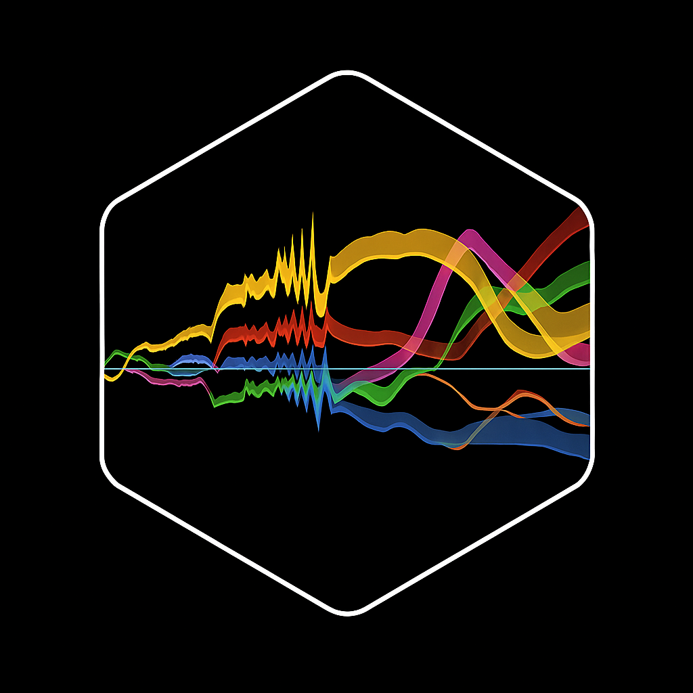

  

PhenoMeNals - Phenology Memory sigNals for Grapevine Yield and Quality Prediction

License: CC BY-NC 3.0
Platform
Language
Status
📖 Overview

PhenoMeNals is an open-source framework for predicting grapevine yield, yield components, and quality traits using a phenology-aware approach. It integrates:

    Phenology modeling of the two-year grapevine reproductive cycle

    Ecophysiological response functions aligned with phenological phases

    Statistical modeling of dynamic cumulative "memory signals"

This hybrid approach captures carry-over effects from Year-1 through harvest (Year 0), providing biologically grounded predictions and insights into environmental influences.
Table of Contents

    Highlights

    Description

    Installation

    Getting Started

    Support

    License

    How It Works

Highlights

    🌱 Two-season phenology model (dormancy + growing phases)

    🧠 Cumulative memory signals derived from 8 ecophysiological functions:
    TempF, ColdF, HeatF, LightF, WindF, DiseaseF, VPDefF, DroughtF

    ⚙️ Handles multicollinearity and uses stepwise feature selection (AIC)

    📈 Validated on multi-site, multi-variety datasets (R² consistently > 0.8)

    🪟 Windows-only backend (cross-platform support planned)

Description

PhenoMeNals is designed for viticulture research and decision support, capturing the progressive effects of environmental cues on grapevine yield and quality.

The workflow:

    Calibrates a chill-forcing phenology model using BBCH phenological observations

    Simulates ecophysiological functions across the standardized phenological timeline (0–400 units spanning Year-1 and Year 0)

    Normalizes and weights signals by correlation strength with the target trait

    Aggregates signals into cumulative memory signals (PhenoMeNals)

    Predicts traits using multiple linear regression and leave-one-out cross-validation (LOOCV)

Installation

    ⚠️ Platform notice:
    PhenoMeNals currently runs only on Windows due to its compiled C# backend.
    Cross-platform support (macOS/Linux) is under development.

1. Install R

Ensure R (≥ 4.0) is installed:
🔗 https://cran.r-project.org/
2. Install Required R Packages

install.packages(c("devtools", "caret", "MASS", "data.table"))

3. Install PhenoMeNals from GitHub

devtools::install_github("YourOrg/PhenoMeNals")

Getting Started

PhenoMeNals includes two main functions:
1. phenologyCalibration()

Calibrates the phenology model using BBCH observations and weather data.
Example:

calib <- phenologyCalibration(
  weather_data = weather_df,
  referenceBBCH = bbch_df,
  sites = "COL",
  varieties = "Carmenere",
  iterations = 200
)

Output: calibrated phenology parameters for each site × variety.
2. runPhenomenals()

Runs the full prediction pipeline using the calibrated phenology and target traits.

results <- runPhenomenals(
  weather_data = weather_df,
  target_data = yield_df,
  start_year = 2006,
  end_year = 2021,
  rolling_window = 3,
  bin_size = 1,
  multicollinearity_threshold = 0.8,
  max_phenomenals = 4
)

Output: structured list with:

    Processed memory signals

    Predictor selection results

    Prediction metrics (R², RMSE, MAE, relative importance)

    Access documentation from R:

?phenologyCalibration
?runPhenomenals

How It Works

PhenoMeNals uses ecophysiological functions to track weather cue effects across phenophases:

    Phenology calibration: chill and heat accumulation (eq. 1)

    Signal normalization: sigmoid scaling (eq. 10)

    Weighting: by correlation with target traits (eq. 11)

    Memory signal aggregation: cumulative trajectories (eq. 12)

<figure> 
  
 <figcaption align="center"><em>PhenoMeNals workflow: from phenology to prediction</em></figcaption> </figure>

    📖 Full details are provided in the presentation paper.

Support

    Open an issue: https://github.com/YourOrg/PhenoMeNals/issues

    Contact the maintainer (see DESCRIPTION)

License

This project is licensed under Creative Commons Attribution-NonCommercial 3.0 (CC BY-NC 3.0).
