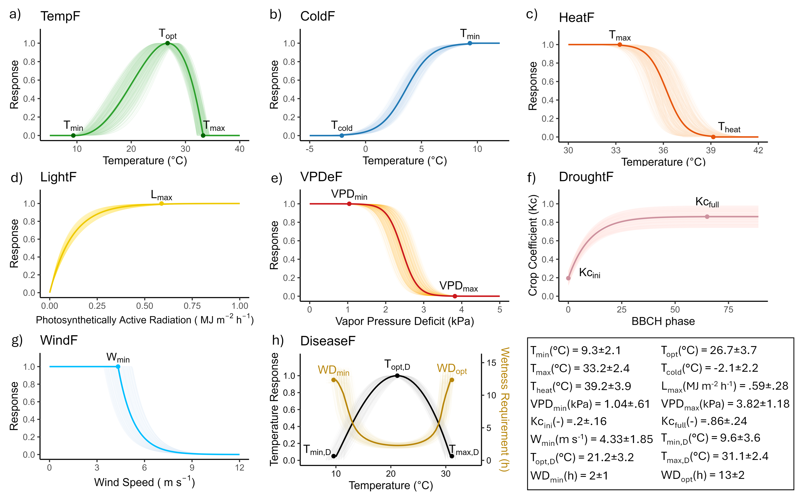

## How it works

PhenoMeNals integrates eco-physiological signals across the grapevine phenological cycle to predict yield and quality traits. This section explains the underlying biological logic and modeling steps.

> 🧠 Recommended for advanced users and researchers interested in model structure and ecophysiological logic.

Grapevine phenology is a cornerstone of yield and quality prediction, as environmental conditions across two growing seasons influence reproductive development. Traditional forecasting models often focus on single seasons or fixed time windows, overlooking these cumulative effects.

**PhenoMeNals** addresses this gap with a **phenology-aware framework** that integrates:

- 🌱 **Phenology simulation** using BBCH observations and weather data  
- 🌡️ **Eco-physiological functions** capturing temperature, radiation, water balance, and stress signals  
- 📊 **Statistical modeling** of cumulative environmental effects (*memory signals*) on yield and quality  

Validated across **multi-site, multi-variety datasets**, PhenoMeNals consistently achieved **R² > 0.8** for yield, yield components, and quality traits.

📄 **See the full description of PhenoMeNals in the paper**:  
*The PhenoMeNals framework for grapevine yield and quality prediction* (Bregaglio & Bajocco, 2025)

<figure>
  <p align="center">
    
  </p>
  <figcaption align="center">
    <em>Figure 1. Overview of the PhenoMeNals workflow. The pipeline integrates BBCH observations and weather data to calibrate a phenological model reproducing the grapevine cycle across two seasons (Year -1 and Year 0). Eco-physiological functions are computed along this timeline and aggregated within phenological bins. Each signal is evaluated for its correlation with the target trait and normalized via sigmoid transformation. The resulting cumulative memory signals (PhenoMeNals) serve as predictors for Leave One Out Cross Validation (LOOCV) using multiple linear regression. Outputs include regression coefficients, variable importance and model diagnostics.</em>
  </figcaption>
</figure>

PhenoMeNals organizes its workflow along the full **two-season grapevine cycle**:

### Year -1: Dormancy and Pre-Harvest Season
- ❄️ Chilling accumulation and dormancy release  
- 🌸 Early reproductive development (primordia differentiation and setup)

### Year 0: Harvest Season
- 🌿 Budburst, flowering, fruit set and ripening  
- 📈 Environmental memory effects captured via cumulative eco-physiological signals  

### Environmental Memory Signals  
Eco-physiological functions (e.g., temperature suitability, drought stress, radiation limitation) are:
1. 🔄 Smoothed and aligned with phenological phases  
2. ⚖️ Normalized and weighted by their correlation with the target trait  
3. ➕ Summed into **PhenoMeNals** — cumulative indicators that drive the final prediction  


---

### 1. Eco-physiological Functions

Eight eco-physiological functions are computed along a standardized phenological timeline. These functions translate weather variables into biologically meaningful indices, normalized between 0 (inhibitory) and 1 (optimal). Each function is parameterized using literature values, with uncertainty bands representing inter-study variation.

| Function   | Description                                                                   |
| ---------- | ----------------------------------------------------------------------------- |
| `TempF`    | Temperature suitability for growth (nonlinear response with Tmin, Topt, Tmax) |
| `ColdF`    | Cold stress response, sigmoidal decay below Tcold                             |
| `HeatF`    | Heat stress response, sigmoidal decay above Theat                             |
| `LightF`   | Radiation limitation, exponential saturation above Lmax (PAR-based)           |
| `VPDeF`    | Vapor pressure deficit limitation, sigmoidal decay between VPDmin and VPDmax  |
| `DroughtF` | Water stress indicator based on transpiration vs. precipitation               |
| `WindF`    | Wind-induced stress, exponential decline beyond Wmin                          |
| `DiseaseF` | Disease favorability (P. viticola) based on temperature and wetness duration  |

All functions are calculated hourly, aggregated daily, and normalized. They serve as potential predictors for downstream modeling. See the figure below

<figure>
<p align="center">
  
  </p>
  <figcaption align="center"><em>Photoperiodic unit for dormancy induction. The shades correspond to the 40-60<sup>th</sup> and 25-75<sup>th</sup> percentiles of the distribution generated with limiting photoperiod ranging from 12 to 14.5 hours and non limiting photoperiod from 11.5 to 13 hours.</em></figcaption>
</figure>

#### Equations
##### 🌡️ Temperature Suitability for Growth (TempF)

$$
\text{TempF} =
\begin{cases}
0 & \text{if } T < T_{\text{min}} \text{ or } T > T_{\text{max}} \\
\left( \frac{T_{\text{max}} - T}{T_{\text{max}} - T_{\text{opt}}} \right)
\cdot
\left( \frac{T - T_{\text{min}}}{T_{\text{opt}} - T_{\text{min}}} \right)^ {
\left( \frac{T_{\text{opt}} - T_{\text{min}}}{T_{\text{max}} - T_{\text{opt}}} \right)} & \text{otherwise}
\end{cases}
$$

This equation simulates the nonlinear temperature response for plant growth using cardinal temperatures: minimum (Tmin), optimum (Topt), and maximum (Tmax). Growth rate peaks at Topt and is zero outside the Tmin–Tmax range.

---

##### 🥶 Cold Stress Response (ColdF)

$$
\text{ColdF} =
\begin{cases}
1 & \text{if } T > T_{\text{min}} \\
0 & \text{if } T < T_{\text{cold}} \\
\frac{1}{1 + \exp\left(\frac{-10}{|T_{\text{min}} - T_{\text{cold}}|} \cdot (T - \frac{T_{\text{min}} + T_{\text{cold}}}{2}) \right)} & \text{otherwise}
\end{cases}
$$

This sigmoid function models the decline in physiological activity as temperature drops below Tmin, reaching zero at a critical cold threshold Tcold.

---

##### 🔥 Heat Stress Response (HeatF)

$$
\text{HeatF} =
\begin{cases}
1 & \text{if } T < T_{\text{max}} \\
0 & \text{if } T > T_{\text{heat}} \\
\frac{1}{1 + \exp\left(\frac{10}{T_{\text{max}} - T_{\text{heat}}} \cdot (T - \frac{T_{\text{max}} + T_{\text{heat}}}{2}) \right)} & \text{otherwise}
\end{cases}
$$

This sigmoid function simulates the impact of extreme heat. The response decreases past Tmax and approaches zero as T approaches Theat.

---

##### ☀️ Light Limitation (LightF)

$$
\text{LightF} = 1 - \exp\left( -k_{\text{light}} \cdot \frac{\text{PAR}}{L_{\text{max}}} \right)
$$

An asymptotic saturation function modeling the effect of photosynthetically active radiation (PAR) on growth. LightF approaches 1 as PAR increases.

---

##### 💨 Vapor Pressure Deficit Limitation (VPDeF)

$$ \text{VPDeF} = \begin{cases} 1 & \text{if } \text{VPD} < \text{VPD}{\text{min}} \ \frac{1}{1 + \exp\left( k{\text{VPD}} \cdot \left( \text{VPD} - \frac{ \text{VPD}{\text{max}} + \text{VPD}{\text{min}} }{2} \right) \right)} & \text{otherwise} \end{cases} $$


This function represents stress induced by high evaporative demand. Limitation increases as VPD surpasses VPDmin.

---

##### 💧 Drought Stress Indicator (DroughtF)

$$
\text{DroughtF} = \frac{(ET_c - \text{Prec})}{(ET_c + \text{Prec})} \cdot \frac{1}{2} + \frac{1}{2}
$$

A normalized aridity index based on crop transpiration (ETc) and precipitation (Prec). Values near 1 indicate water stress.

---

###### 🌱 Crop Coefficient (Kc)

$$
K_c =
\begin{cases}
K_{\text{max}} & \text{if } BBCH > 65 \\
K_{\text{ini}} + (K_{\text{full}} - K_{\text{ini}}) \cdot \frac{1 - \exp(-0.1 \cdot BBCH)}{1 - \exp(-0.1 \cdot 65)} & \text{otherwise}
\end{cases}
$$

Describes the development of canopy cover through phenology using BBCH scale. Used to scale ET₀ into ETc.

---

##### 🌬️ Wind-Induced Stress (WindF)

$$
\text{WindF} =
\begin{cases}
1 & \text{if } W < W_{\text{min}} \\
\exp(-k_{\text{wind}} \cdot (W - W_{\text{min}})) & \text{otherwise}
\end{cases}
$$

Models the exponential decline in physiological performance under high wind speeds. Applied across the phenological cycle.

---

##### 🦠 Disease Favorability (DiseaseF)

$$
\text{DiseaseF} =
\begin{cases}
1 & \text{if } WD > WD_{\text{opt}} \\
0 & \text{if } WD < WD_{\text{min}} \\
\frac{WD_{\text{min}} / f(T)}{WD_{\text{opt}}} & \text{otherwise}
\end{cases}
$$

Evaluates the infection risk of **P. viticola** based on temperature suitability and wetness duration. Uses the same temperature response as TempF.

---

### 2. Phenology-Based Binning & Correlation Analysis

Each eco-physiological signal is:

1. Smoothed using a rolling mean (default: 3 days)
2. Discretized along a 0–400 phenological timeline (default: 1-bin resolution)

This alignment captures biological stages rather than calendar dates. Pairwise correlations among signals are computed to detect multicollinearity. Signals with r > 0.9 are screened, and the least redundant signal is retained.

Each bin's correlation with target traits (e.g., yield, brix) is evaluated using Pearson’s r and associated p-value. Trait values are min–max normalized within each site–variety combination to \[–1, 1], generating a correlation profile across the phenological cycle.

---

### 3. Sigmoid Scaling, Weighting, and Signal Aggregation

Smoothed signals are normalized using a sigmoid transformation:

```
scaled_i = 1 / (1 + exp(-10 * (f_i - f̃) / ((f_90 - f_10) / 2)))
```

* `f_i`: Signal value in year *i*
* `f̃`: Median value across years for that bin
* `f_10`, `f_90`: 10th and 90th percentiles

Then, signals are weighted by correlation strength:

```
weighted_i = scaled_i * r * (1 - p)
```

Finally, weighted signals are summed across bins to produce cumulative PhenoMeNals:

```
PhenoMeNal_{i,j} = Σ weighted_{i,j}(bin) for bin = 1 to 400
```

---

### 4. Model Selection and Trait Prediction

A stepwise variable selection using AIC (via `stepAIC` from the `MASS` package) identifies the most informative subset of PhenoMeNals per bin (max predictors: 4). For each bin:

* A multiple linear regression model is trained using selected PhenoMeNals
* Leave-One-Out Cross-Validation (LOOCV) is applied (`caret` package)
* Metrics computed include R², RMSE, MAE, and nMBE

Predictor importance is assessed using the LMG method (Groemping, 2006), which decomposes R² by averaging contributions across all possible predictor orderings. Diagnostic plots include prediction–observation correlation, residual analysis, and phenology–prediction alignment.

---

